### 引言
随着网页功能变得愈发复杂和精细，以及手机端H5发展中所遇到的硬件性能瓶颈，网页的运行时性能问题变得越来越突出。而用户对于网页运行时性能最直观的感受，莫过于UI操作的流畅程度。流畅或卡顿，爽或不爽，皆在于每个UI动画细节之间。本文旨在帮助理解动画卡顿与流畅的原因，卡顿问题的调试方法，以及从实践中总结出实现流畅动画的规律。为构建操作流畅的网页提供参考。

### 索引
* [量化动画的流畅程度](#quantify-performance)
* [了解浏览器的渲染机制](#how-browser-works)
* [动画调优的策略与技巧](#ploy-and-skills)
* [案例调优实战](#cases)

## 量化动画的流畅程度<quantify-performance>
[动画](http://zh.wikipedia.org/wiki/动画)的实现原理，是利用了人眼的“[视觉暂留](http://zh.wikipedia.org/wiki/視覺暫留)”现象，在短时间内连续播放数幅静止的画面，使肉眼因视觉残象产生错觉，而误以为画面在“动”。

##### 动画相关的几个概念
* **帧**：在动画过程中，每一幅静止画面即为一“帧”。
* **[帧率](http://zh.wikipedia.org/wiki/帧率)**：即每秒钟播放的静止画面的数量，单位是fps(Frame per second)。
* **帧时长**：即每一幅静止画面的停留时间，单位一般是ms(毫秒)。
* **跳帧(掉帧/丢帧)**：在帧率固定的动画中，某一帧的时长远高于平均帧时长，导致其后续数帧被挤压而丢失的现象。

##### 身边的帧率（频率）：
* 10 FPS		     达成基本视觉暂留
* 25～30 FPS	         传统广播电视信号
* _**60 FPS**        浏览器渲染刷新频率_
* 60～85 HZ	         显示器刷新频率
* 100 HZ		     日光灯管闪烁频率

##### 帧率能反映动画的流畅程度
* 在网页中，帧率能够达到50~60fps的动画将会相当流畅，让人倍感舒适。
* 帧率在30～50fps之间的动画，因各人敏感程度不同，舒适度因人而异。
* 帧率在30fps以下的动画，让人感觉到明显的卡顿和不适感。
* 帧率波动很大的动画，亦会使人感觉到卡顿。

##### 用帧率量化动画流畅度的几个例子
* 帧率稳定在60fps左右的流畅动画

    <iframe class="matrix-iframe" width="100%" height="200" src="http://fiddle.jshell.net/Alexorz/KqzeV/show/light/" allowfullscreen="allowfullscreen" frameborder="0"></iframe>

* 帧率稳定但低于30fps的卡顿动画（帧率低导致卡顿）

    <iframe class="matrix-iframe" width="100%" height="200" src="http://fiddle.jshell.net/Alexorz/KqzeV/show/light/?mode=lowfps" allowfullscreen="allowfullscreen" frameborder="0"></iframe>

* 平均帧率高，但存在跳帧现象的卡顿动画（帧率不稳定导致卡顿）

    <iframe class="matrix-iframe" width="100%" height="200" src="http://fiddle.jshell.net/Alexorz/KqzeV/show/light/?mode=jumpframe" allowfullscreen="allowfullscreen" frameborder="0"></iframe>

##### 几款帧率监测工具

* [Stats.js](https://github.com/mrdoob/stats.js)，侦听全局或指定位置的帧率，JS实现，所有浏览器可用

	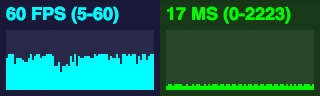

* Chrome自带的帧率监测工具，用于侦听全局帧率，以及页面重绘耗时

	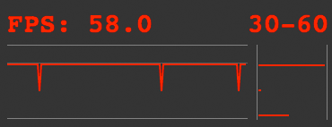
	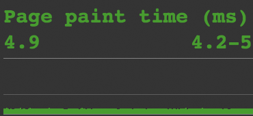
	<!-- 
	 -->

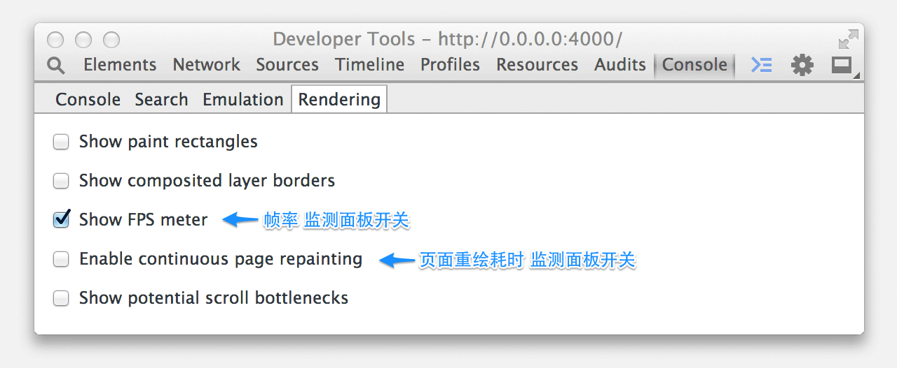

* Chrome Timeline，杀手级监测 & 调试工具

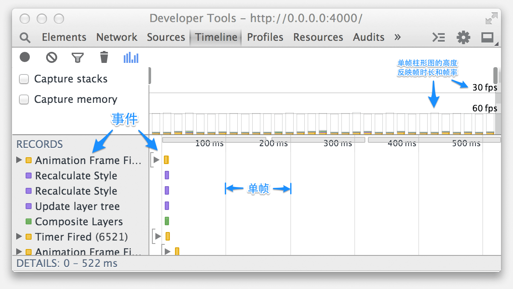

##### 小结

帧率能够量化动画的流畅程度，流畅的动画一般具备两个特点：

* **帧率高**（接近60fps最佳）
* **帧率稳定，波动少**（极少出现跳帧现象）

## 了解浏览器的渲染机制<how-browser-works>
每当性能提升工作遇到瓶颈时，我们总是会尝试从底层实现机制中寻找突破口。动画性能优化也不例外，想要将动画性能提升到极致，首先我们需要知道浏览器是如何渲染每一帧的。

##### 浏览器的渲染引擎
各厂出品的浏览器所用的渲染引擎不尽相同：
  IE使用[Trident](zh.wikipedia.org/wiki/Trident_(排版引擎))
，FireFox使用[Gecko](http://zh.wikipedia.org/wiki/Gecko)
，Safari使用[WebKit](http://zh.wikipedia.org/wiki/Webkit)
，Chrome 28+ 和 Opera 15+使用的是[Blink](http://zh.wikipedia.org/wiki/Blink)（WebKit的分支）。

来看两个例子：

* Webkit的渲染流程
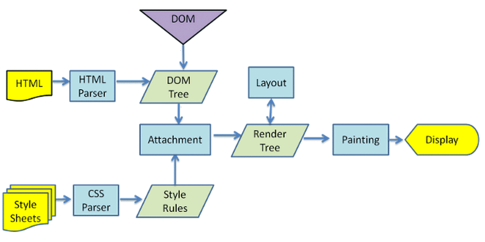

* Gecko的渲染流程
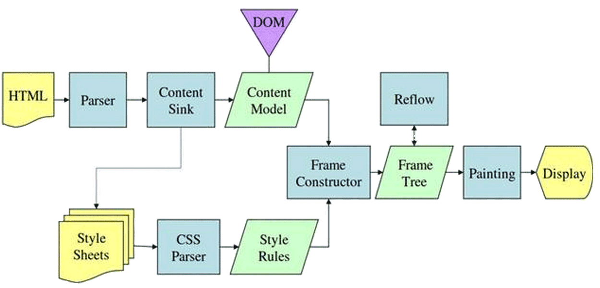

虽然浏览器款式如此之多，但当我们对比WebKit和Gecko这两款引擎的工作流程，会发现二者大体的流程以及一些关键环节还是基本相同的。

几个关键的工作环节：

* **HTML解析**（Parse HTML）
* **解析CSS**（Parse CSS）
* **生成渲染树**（Render Tree / Frame Tree）
* **排版/重排**（Layout/Reflow）
* **绘图/重绘**（Painting）

各款渲染引擎的基本工作流程可以抽象为下图：
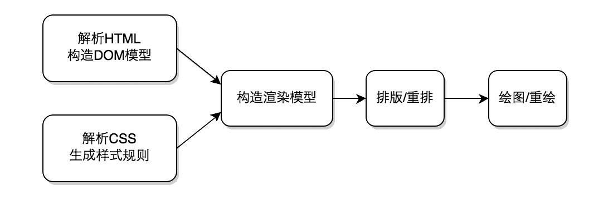

可见，对于**通过修改HTML元素CSS样式实现的动画**，每修改一次CSS，浏览器就会做一次上图中CSS解析及其随后的操作。
（但并不是每一次对CSS的修改都会重新排版和绘图）

##### 通过工具监测浏览器渲染行为
目前对浏览器渲染行为的监测，实现较好的是Chrome与Safari，并且这两者能远程调试Android和iOS设备中的Chrome和Safari浏览器（Chrome在Android 4.0后开始支持）。

借助Chrome和Safari的Timeline工具，分析耗时较长的帧，我们便能定位到渲染耗时长的原因，并针对问题原因寻找解决方案。

* Chrome Timeline

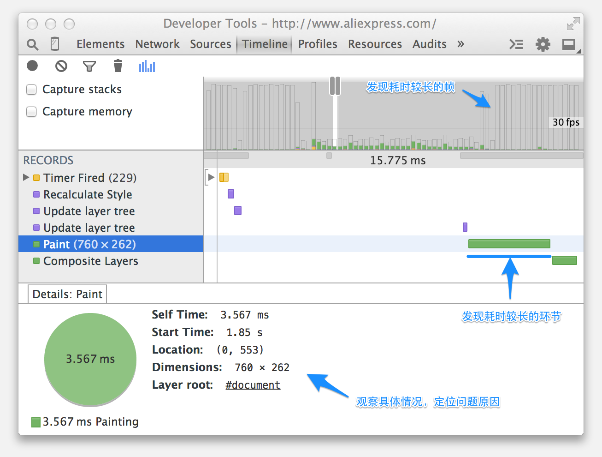

* Safari Timeline

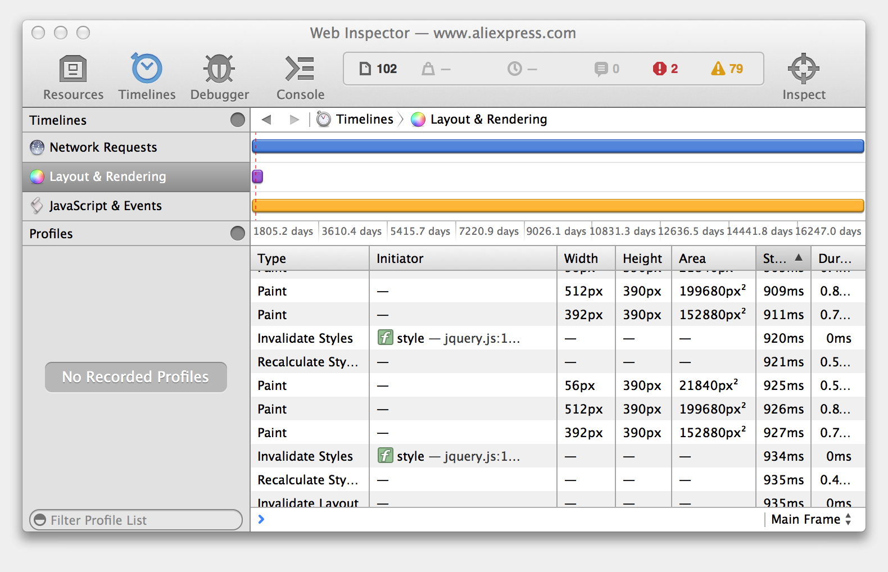

##### 现代浏览器的硬件加速渲染通道以及层模型(Layer model)

近些年来，现代浏览器借助于显卡的优势改变了渲染操作：通常被笼统的称为“硬件加速(hardware acceleration)”。

以Chrome为例，在硬件加速渲染通道下，复杂的页面会被分为多个层(Layer)，
Chrome对各个层分别进行排版、绘图，再将绘图结果作为“[纹理](http://zh.wikipedia.org/wiki/纹理贴图)”上传至GPU，
由GPU完成层的3D变换(transform)等操作，最后再将GPU渲染好的层图像进行复合操作(Compesite Layers)，得到最终的画面结果。
因此，通过3D变换实现的位移、旋转、缩放将不会触发浏览器重绘（除非层的内容发生改变）。

可见，可以避免重绘的层模型对于动画调优有着重大意义。

##### 通过工具“看到”层
* Chrome

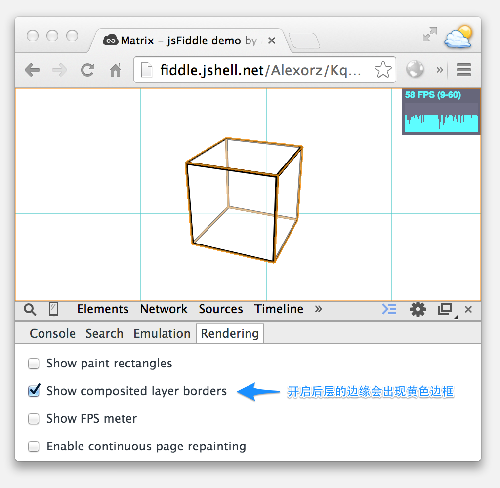

* Safari

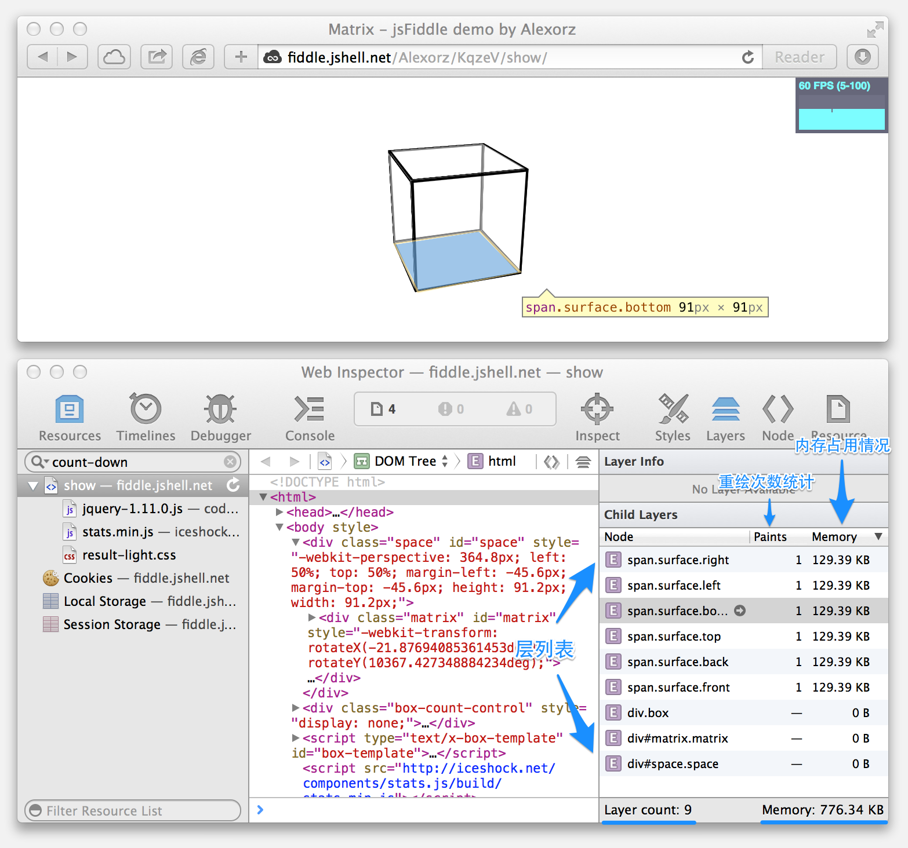

##### 通过分层减小重绘面积
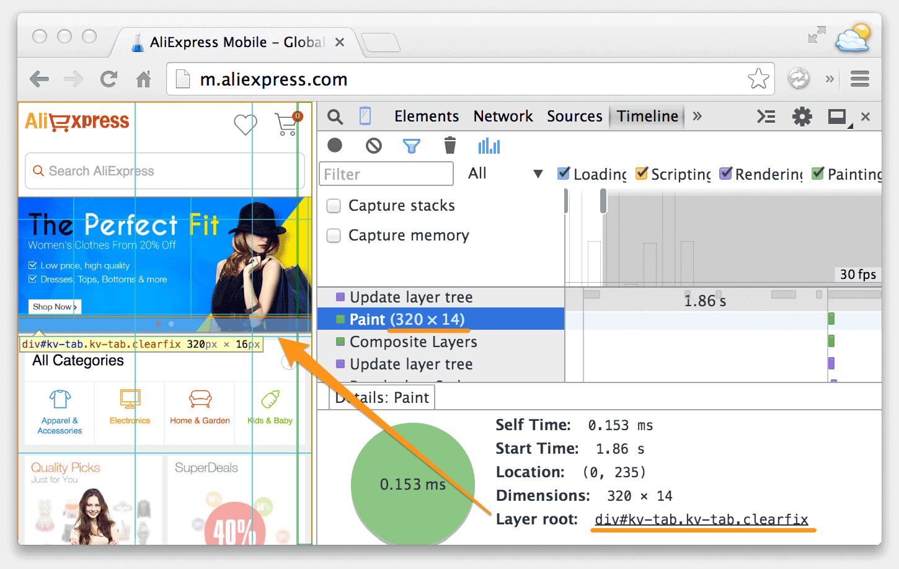

##### 如何创建新的层
从目前来看（Chrome、Safari等现代浏览器仍在不断迭代演进），以下情况下元素会创建自己的层（包括但不限于以下情况，待完善）：

* 触发普通元素的分层：
    * transform:translate3d或perspective(透视)属性
    * position:fixed属性

* 自带单独分层的元素
    * 使用加速视频解码的&lt;video&gt;元素
    * &lt;iframe&gt;元素
    * Flash等插件

<!--

* Position:absolute/fixed属性
* 对自己的opacity做CSS动画，或使用一个动画 webkit 变换的元素
* 拥有加速CSS过滤器的元素
* 元素有一个包含复合层的后代节点(换句话说，就是一个元素拥有一个子元素，该子元素在自己的层里)
* 元素有一个 z-index 较低且包含一个复合层的兄弟元素(换句话说就是该元素在复合层上面渲染)

-->

<!-- ##### 重绘和重排的时间开销 -->

## 动画调优的策略与技巧<ploy-and-skills>

* **提升每一帧性能（缩短帧时长，提高帧率）**
	* 避免频繁的重排。
	* 避免大面积的重绘。
	* 优化JS运行性能。

* **保证帧率平稳（避免跳帧）**
	* 不在连续的动画过程中做高耗时的操作（如大面积重绘、重排、复杂JS执行），避免发生跳帧。
	* 若高耗时操作无法避免，则尝试化解，比如：
		1. 将高耗时操作放在动画开始或结尾处。
		2. 将高耗时操作分摊至动画的每一帧中处理。

* **针对硬件加速渲染通道的优化**
    * 通过层的变化效果(如transform)实现位移、缩放等动画，可避免重绘。
    * 合理划分层，动静分离，可避免大面积重绘。
    * 使用分层优化动画时，需要留意内存消耗情况（通过Safari调试工具）。

* **低性能设备优先调试**
	* Android设备优先调试：移动设备的硬件配置一般低于桌面设备，而移动端设备中，Android设备相比于iOS设备性能普遍较差，因此在Andorid设备下性能问题更加明显，幸运的是Android可以借助Chrome自带的远程调试工具方便调试动画性能（Android 4.0+），所以优先调试Android设备可以更早地发现问题，并能更方便地解决问题。

<!--
* **避开浏览器的渲染Bug**
    * 不建议异步载入CSS：Webkit系浏览器中，异步载入CSS文件会使页面渲染停顿（页面中存在持续pending的CSS请求时十分明显）。
-->

## 案例调优实战<cases>
// To be done.

## 未完结

    本文仍在更新中，欢迎通过Github Watch关注更新动态
    <iframe src="http://alexorz.github.io/animation-performance-guide/github-btn/github-btn.html?user=alexorz&repo=animation-performance-guide&type=watch&count=true" style="vertical-align: middle; margin-top: -5px; margin-left: 5px;" allowtransparency="true" frameborder="0" scrolling="0" width="120" height="20"></iframe>

有更多想法，欢迎交流，想要拍砖、指正、提建议，[请戳这里](https://github.com/Alexorz/animation-performance-guide/issues/new)。

## 参考资料
* [How Browsers Work: Behind the scenes of modern web browsers](http://www.html5rocks.com/en/tutorials/internals/howbrowserswork/)
* [Accelerated Rendering in Chrome](http://www.html5rocks.com/zh/tutorials/speed/layers/)
* [Rendering: repaint, reflow/relayout, restyle](http://www.phpied.com/rendering-repaint-reflowrelayout-restyle/)
* [How (not) to trigger a layout in WebKit](http://gent.ilcore.com/2011/03/how-not-to-trigger-layout-in-webkit.html)
* [Profiling Long Paint Times with DevTools' Continuous Painting Mode](http://updates.html5rocks.com/2013/02/Profiling-Long-Paint-Times-with-DevTools-Continuous-Painting-Mode)

